## Что сделано

- Прочитано и разобрано задание из `python_testovoe.pdf`.
- Найдены и исправлены баги в конфигурации, планировщике, парсере, CRUD и API.
- Выполнены smoke-проверки импорта приложения и синтаксиса.

## Исправленные баги

1. **Неверное имя env-переменной для БД**
   - Файл: `app/core/config.py`
   - Проблема: при первом запуске приложения возникала ошибка валидации настроек Pydantic (`ValidationError: Extra inputs are not permitted`), поле `database_url` не подтягивалось из окружения.
   - Причина: в `Settings` был указан алиас `validation_alias="DATABSE_URL"` (опечатка), тогда как в `.env` используется `DATABASE_URL`.
   - Решение:  алиас приведен к корректному имени `DATABASE_URL`, чтобы Pydantic читал правильную переменную.

2. **Некорректный default `database_url`**
   - Файл: `app/core/config.py`
   - Проблема: при запуске миграций Alembic в Docker приложение падало с ошибкой подключения к БД: `asyncpg.exceptions.InvalidCatalogNameError: database "postgres_typo" does not exist`.
   - Причина: приложение не подключалось к БД при использовании дефолтного значения (без корректного `.env`). Если строки в `.env` закоментить, значение по умолчанию для `database_url` указывало на несуществующую БД `postgres_typo`.
   - Решение: приведено дефолтное значение в коде к корректной базе (`postgres`): `postgresql+asyncpg://postgres:postgres@db:5432/postgres`.

3. **Падение парсера на вакансиях с `city = null`**
   - Файл: `app/services/parser.py`
   - Проблема: при запуске фонового парсинга вакансий приложение падало с ошибкой  `AttributeError: 'NoneType' object has no attribute 'name'`.
   - Причина: в исходных данных API поле `city` может быть `null`, но код всегда вызывал `item.city.name.strip()` и не учитывал то ,что `city` может быть `null`. 
   - Решение: добавлена безопасная обработка `None`.

4. **Несоответствие имени query-параметра фильтра по городу**
   - Файл: `app/api/v1/vacancies.py`
   - Проблема: фильтрация по городу реализована с несогласованными именами. query‑параметр API называется `city`, тогда как в доменной модели и схеме ответа используется поле `city_name`. Если попробовать вызвать `GET /api/v1/vacancies?city_name=Москва`, фильтрации не будет вообще, потому что endpoint параметр `city_name` не ожидает.

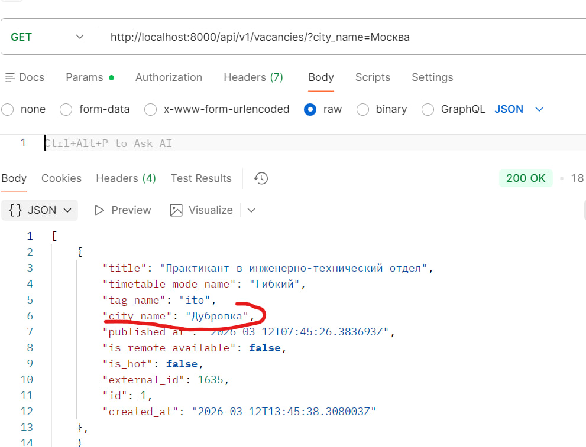

   - Решение: API приведен к единому имени `city_name` и корректной передаче в CRUD.

5. **Некорректная обработка дубликата `external_id`**
   - Файл: `app/api/v1/vacancies.py`
   - Проблема: при попытке создать вакансию с уже существующим `external_id` API отвечал `200 OK`, что нарушало семантику REST.
   
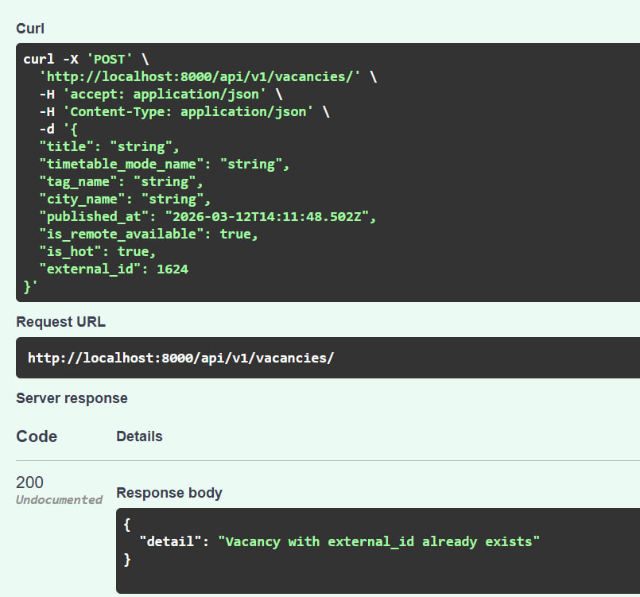

   - Причина: в эндпоинте `POST /vacancies` при нахождении дубликата `external_id` возвращается объект `JSONResponse` с явно заданным статусом `200 OK`, вместо выбрасывания HTTP‑ошибки с соответствующим кодом (`409 CONFLICT`).
   - Решение: код
     `return JSONResponse(status_code=status.HTTP_200_OK, content={"detail": "Vacancy with external_id already exists"})`
     был заменен на  `HTTPException(status_code=409, detail="Vacancy with external_id already exists")` в `vacancies.py` (строки 51–54).

6. **Обновление вакансии требовало все поля и затирало значения**
   - Файлы: `app/schemas/vacancy.py`, `app/crud/vacancy.py`
   - Проблема: с точки зрения REST такое поведение допустимо для `PUT` (полная замена ресурса), но на практике реализация оказалась очень хрупкой: клиент не заполняет и даже не получает часть полей из API (например, `created_at`), не знает об их существовании и, передавая неполный объект или дефолтные значения, фактически затирал реальные данные в базе.
   - Причина: схема `VacancyUpdate` наследовалась от полной базовой схемы с обязательными полями, а вызов `data.model_dump()` возвращал все поля, включая те, которые пользователь не хотел менять или вообще не контролировал.
   - Решение: для повышения надёжности API и предотвращения потери данных `VacancyUpdate` была сделана частичной (все поля `Optional[...]`), а в CRUD при обновлении используется `data.model_dump(exclude_unset=True)` я заменил:

     старый вариант:
     `for field, value in data.model_dump().items(): setattr(vacancy, field, value)`

     на корректный:
     `for field, value in data.model_dump(exclude_unset=True).items(): setattr(vacancy, field, value)`

7. **Утечка ресурсов HTTP-клиента**
   - Файл: `app/services/parser.py`
   - Проблема: `AsyncClient` использует пул HTTP-соединений для повторного использования TCP конектов.. В функции парсинга вакансий создаётся экземпляр этого объекта который не закрывается после завершения работы. Это может приводить к утечке ресурсов (открытых соединений, сокетов) и накоплению висящих клиентских объектов при многократных запусках фонового задания.
   - Причина:`AsyncClient` создавался вручную без гарантированного закрытия.
   - Решение: клиент переведен на контекстный менеджер `async with httpx.AsyncClient(...)`.

8. **Неправильный интервал парсинга**
   - Файл: `app/services/scheduler.py`
   - Проблема: интервал фонового парсинга вакансий не соответствовал ТЗ: парсинг выполнялся каждые 5 секунд вместо указанных 5 минут.
   - Причина: в конфигурации планировщика APScheduler параметр `parse_schedule_minutes`, задающий период в минутах, передавался в аргумент `seconds`, поэтому значение трактовалось как секунды.
   - Решение: параметр триггера заменен на `minutes=settings.parse_schedule_minutes`.

## Дополнительно

9. **Ошибка 500 при `PUT` с конфликтующим `external_id`**
   - Файл: `app/api/v1/vacancies.py`
   - Проблема: при обновлении вакансии через `PUT /api/v1/vacancies/{id}` с `external_id`, который уже занят другой записью, API возвращал `500 Internal Server Error` вместо корректного бизнес-ответа `409 CONFLICT`.

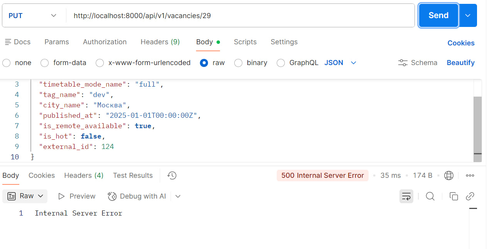

   - Причина: в endpoint обновления не было предварительной проверки уникальности `external_id` для случая апдейта, поэтому конфликт ловился только на уровне БД (`IntegrityError`).
   - Решение: перед обновлением добавлена явная проверка `external_id` на дубликат через `get_vacancy_by_external_id(...)`; при конфликте теперь возвращается `HTTPException(status_code=409, detail="Vacancy with external_id already exists")`.

После исправления основных багов я решил немного улучшить проект от себя:
- **Тесты.** Написал unit- и integration-тесты. Они лежат в папке `tests/`: юнит-тесты в `tests/unit/`, интеграционные в `tests/integration/`, общие фикстуры  — в `tests/conftest.py`. Конкретно: проверка схем `VacancyCreate`/`VacancyUpdate` (`test_schemas_vacancy.py`), CRUD и upsert вакансий (`test_crud_vacancy.py`), парсер при `city=null` и при ошибке сети (`test_parser_service.py`), полный цикл CRUD по HTTP, дубликат `external_id` при POST и PUT, фильтры по городу и расписанию (`test_vacancies_api.py`), ручной запуск парсинга (`test_parse_api.py`). Запуск: `pytest`.
- Подключил метрики через Prometheus и Grafana для наблюдаемости API и фонового парсинга.

## Итого

Все эндпоинты работают корректно.  
Приложение возвращает корректные HTTP-статусы и данные.

### Подтверждающие скриншоты

- Успешное получение списка вакансий (`GET /api/v1/vacancies/`):

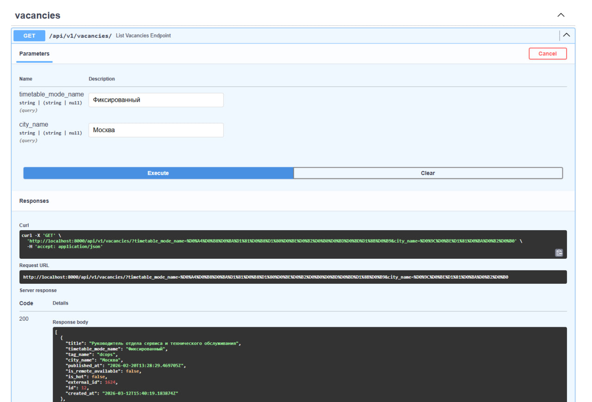

- Данные корректно сохраняются в БД:

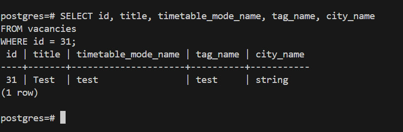

- Успешное получение вакансии по ID (`GET /api/v1/vacancies/{id}`):

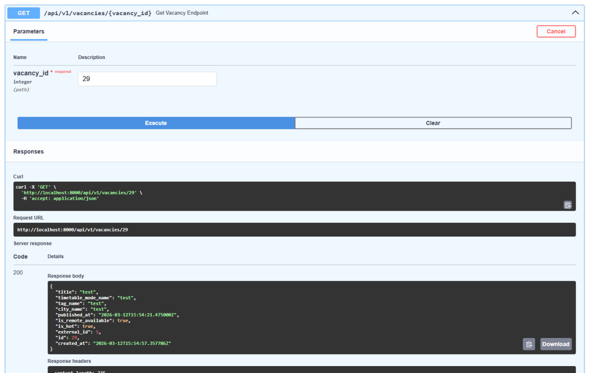

- Успешное создание вакансии (`POST`) — длинный скрин, из 2-х частей

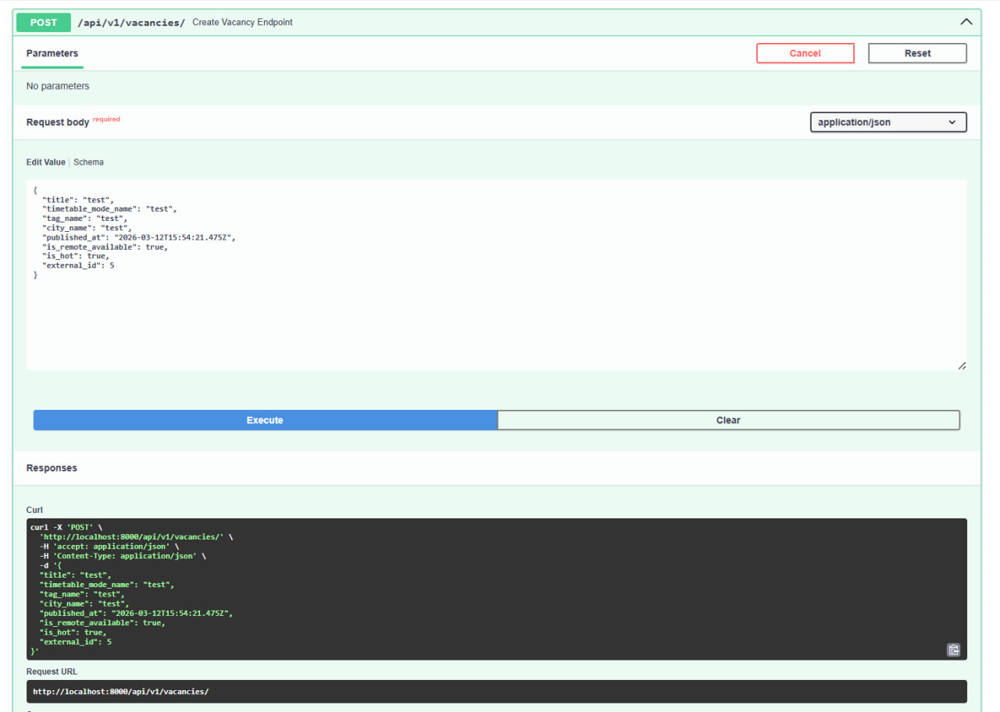
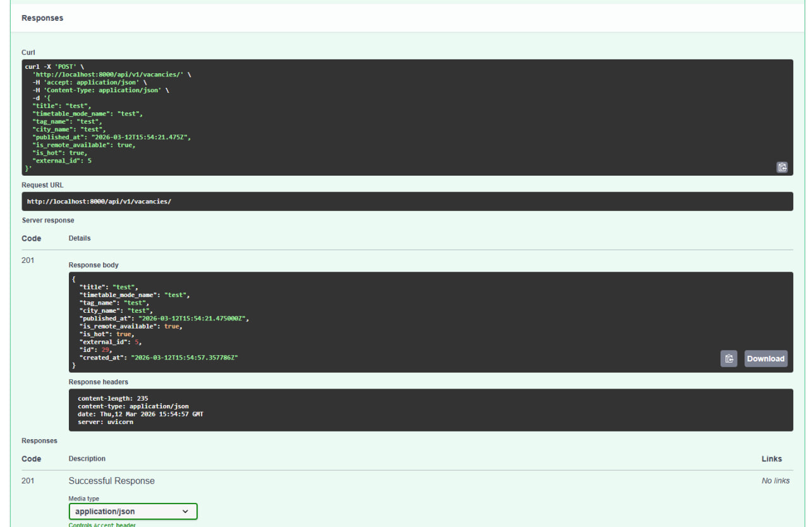

- Успешное обновление вакансии (`PUT`) — длинный скрин:

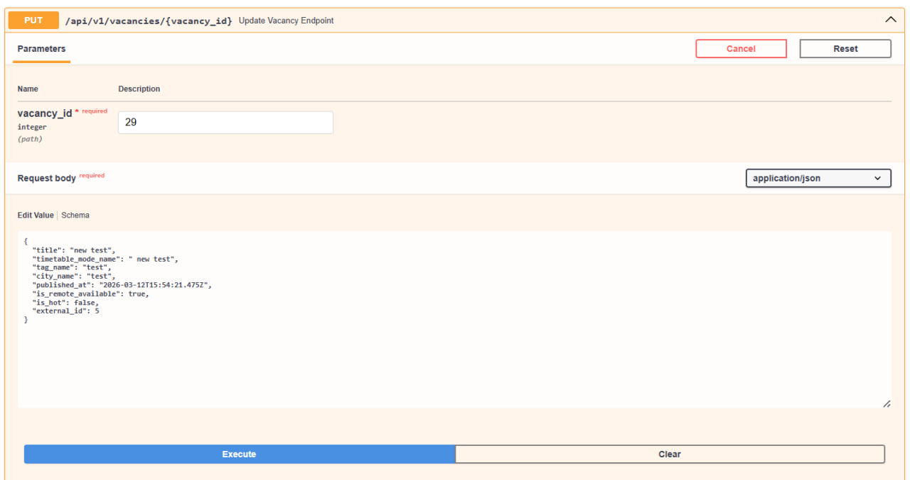
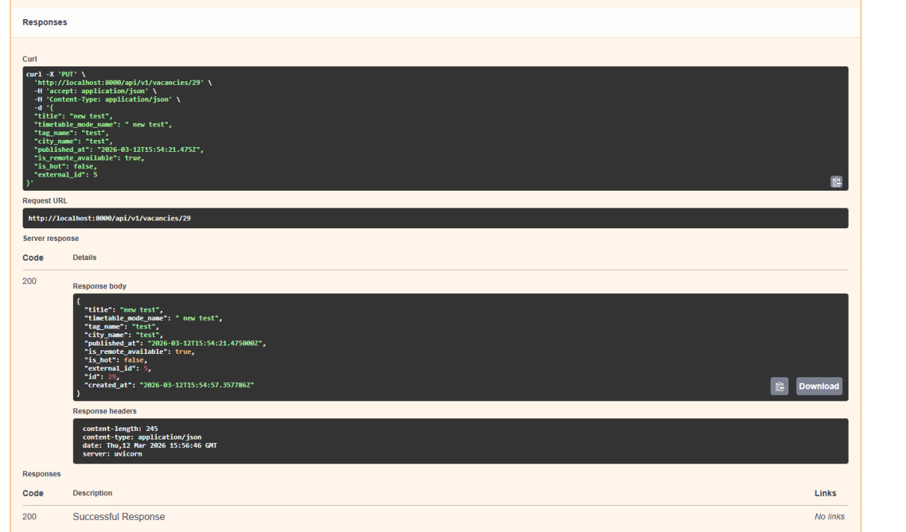

- Успешное удаление вакансии (`DELETE`):

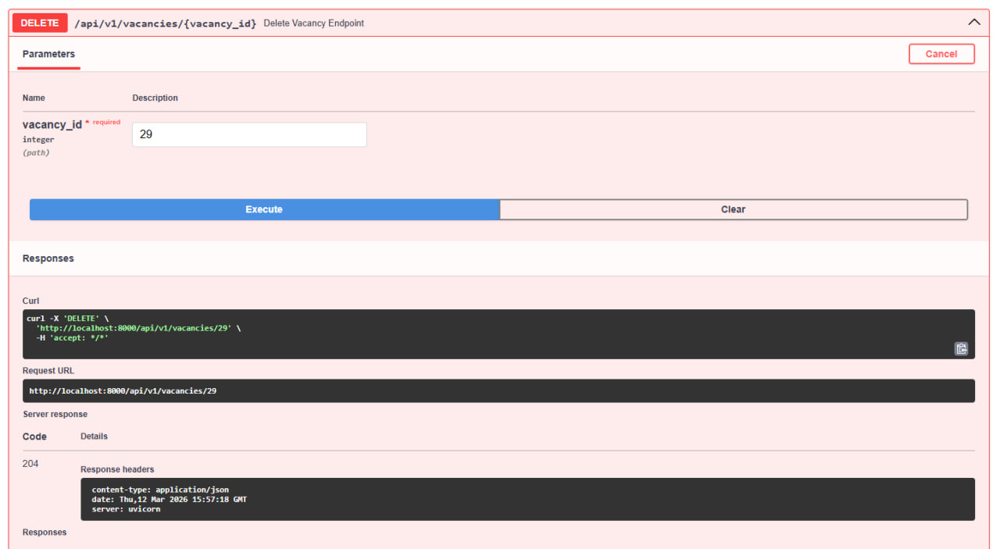

- Ручной запуск парсинга:

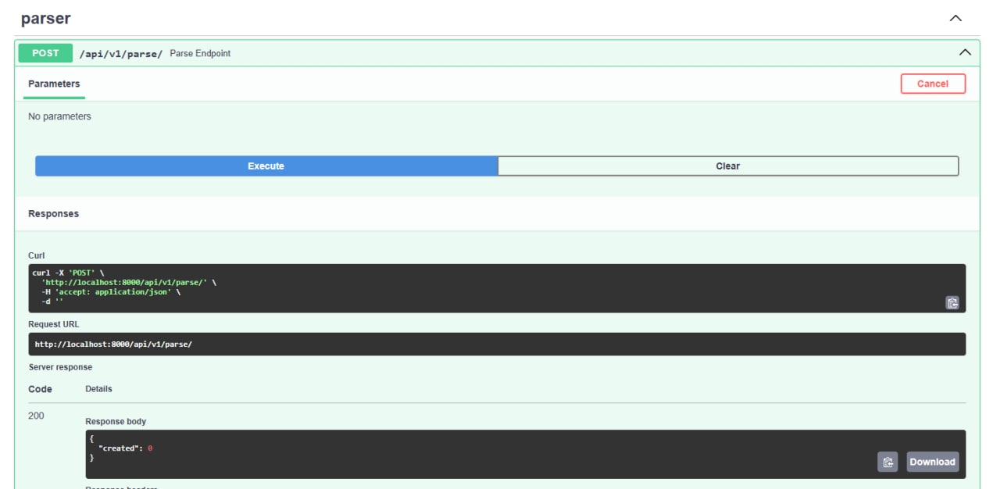

- Успешный прогон тестов:

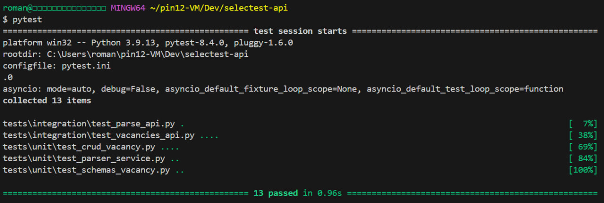

- Отображение метрик в Grafana:

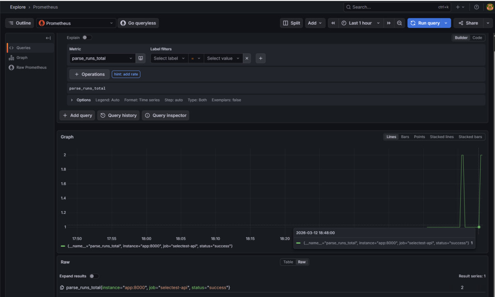

